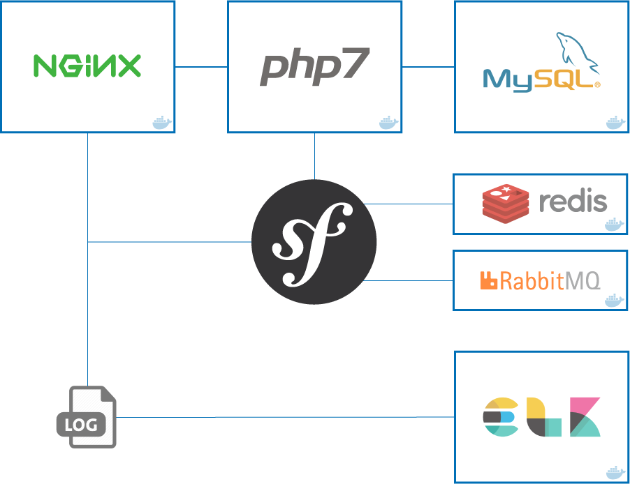

# Complete Docker stack for Symfony 3

[](LICENSE)
[](https://github.com/carlosas/docker-for-symfony/issues)
[](http://hits.dwyl.com/carlosas/docker-for-symfony)



## Basic info

* [nginx](https://nginx.org/)
* [PHP-FPM](https://php-fpm.org/)
* [MySQL](https://www.mysql.com/)
* [Redis](https://redis.io/)
* [Elasticsearch](https://www.elastic.co/products/elasticsearch)
* [Logstash](https://www.elastic.co/products/logstash)
* [Kibana](https://www.elastic.co/products/kibana)
* [RabbitMQ](https://www.rabbitmq.com/)

## Previous requirements

This stack needs [docker](https://www.docker.com/) and [docker-compose](https://docs.docker.com/compose/) to be installed.

## Installation

1. Create a `.env` from the `.env.dist` file and adapt it according to the needs of the application

    ```sh
    $ cp .env.dist .env && nano .env
    ```

2. Build/run containers in detached mode

    ```sh
    $ docker-compose build
    $ docker-compose up -d
    ```

3. Update your system's hosts file

    ```sh
    # Get bridge IP address and update hosts file
    $ sudo echo $(docker network inspect bridge | grep Gateway | grep -o -E '[0-9\.]+') "symfony.dev" >> /etc/hosts
    ```

4. Prepare the Symfony application
    1. Update Symfony parameters (*app/config/parameters.yml*)

        ```yml
        parameters:
            database_host: db
            #...
            redis_host: redis
        ```

    2. Composer install & create database

        ```sh
        $ docker-compose exec php bash
        $ composer install
        $ symfony doctrine:database:create
        $ symfony doctrine:schema:update --force
        ```
5. (Optional) Xdebug: Configure your IDE to connect to port `9001` with key `PHPSTORM`

## How does it work?

We have the following *docker-compose* built images:

* `nginx`: The Nginx webserver container in which the application volume is mounted.
* `php`: The PHP-FPM container in which the application volume is mounted too.
* `db`: The MySQL database container.
* `elk`: Container which uses Logstash to collect logs, send them into Elasticsearch and visualize them with Kibana.
* `redis`: The Redis server container.
* `rabbitmq`: The RabbitMQ server/administration container.

Running `docker-compose ps` should result in the following running containers:

```
           Name                          Command               State              Ports
--------------------------------------------------------------------------------------------------
container_mysql         /entrypoint.sh mysqld            Up      0.0.0.0:3306->3306/tcp
container_elk           /usr/bin/supervisord -n -c ...   Up      0.0.0.0:81->80/tcp
container_nginx         nginx                            Up      443/tcp, 0.0.0.0:80->80/tcp
container_phpfpm        php-fpm                          Up      0.0.0.0:9000->9000/tcp
container_redis         docker-entrypoint.sh redis ...   Up      6379/tcp
container_rabbit        rabbitmq:3-management            Up      4369/tcp, 5671/tcp, 0.0.0.0:5672->5672/tcp, 15671/tcp, 25672/tcp, 0.0.0.0:15672->15672
```

## Usage

Once all the containers are up, our services are available at:

* Symfony app: [symfony.dev](http://symfony.dev)
* Kibana: [symfony.dev:81](http://symfony.dev:81)
* RabbitMQ: [symfony.dev:15672](http://symfony.dev:15672)
* Log files location: *logs/nginx* and *logs/symfony*

---

:notebook: More information and useful stuff in the [wiki](https://github.com/carlosas/full-docker-for-symfony-3/wiki).
